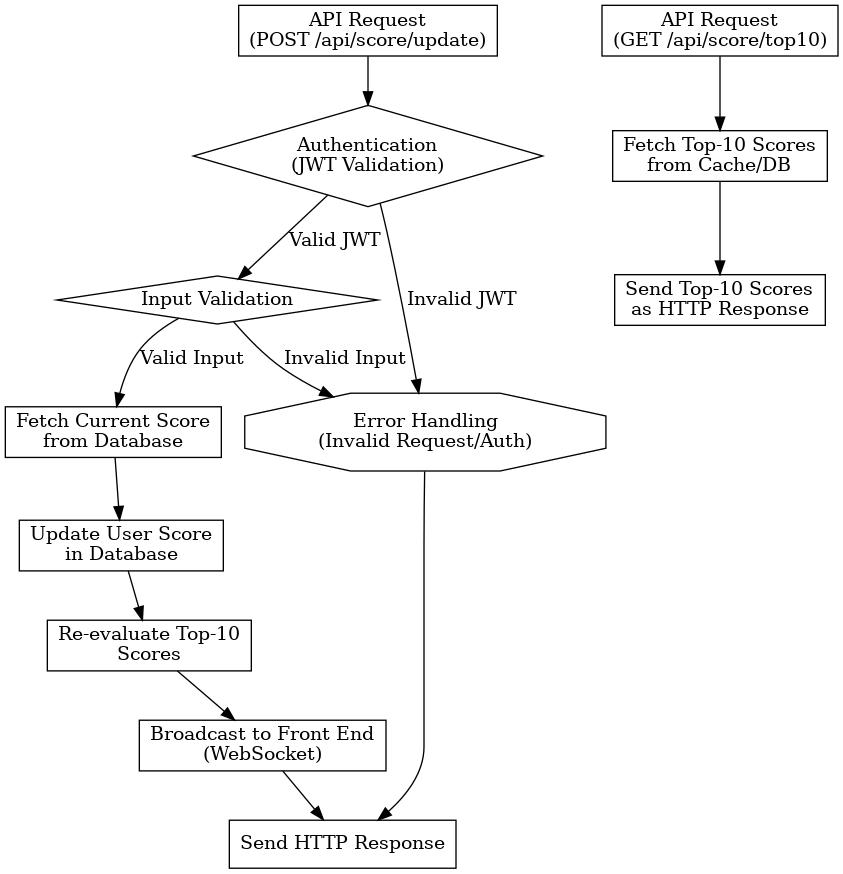

# Scoreboard API Module

Write the specification for a software module on the API service (backend application server).

1. Create a documentation for this module on a README.md file.
2. Create a diagram to illustrate the flow of execution.
3. Add additional comments for improvement you may have in the documentation.
4. Your specification will be given to a backend engineering team to implement.

## Software Requirements

1. We have a website with a score board, which shows the top 10 user’s scores.
2. We want live update of the score board.
3. User can do an action (which we do not need to care what the action is), completing this action will increase the user’s score.
4. Upon completion the action will dispatch an API call to the application server to update the score.
5. We want to prevent malicious users from increasing scores without authorisation.

## System design

### Features

#### 1. Top-10 Scoreboard:

- Maintains a live list of the top 10 users with the highest scores.
- Updates the scoreboard in real-time whenever a score changes.

#### 2. Score Update Endpoint:

- An API endpoint to handle user score updates.
- Validates and processes score changes upon receiving a request.

#### 3. Security Measures:

- Prevents unauthorized updates through authentication and validation mechanisms.
- Logs suspicious activities for monitoring and further investigation.

### Design Endpoints

#### 1. `GET /api/score/top10`

- Description: Retrieves the current top 10 scores from the leaderboard.

- Request:

  - Method: GET
  - Response:
    - Success (200):
      ```json
      {
      "status": "success",
      "topScores": [
          { "userId": "string", "score": "number" },
          ...
        ]
      }
      ```
    - Server Error (500):
      ```json
      {
        "status": "error",
        "message": "Internal server error"
      }
      ```

- Additional Notes:
  - The endpoint retrieves data from an in-memory cache (like Redis) for efficiency.
  - Includes timestamps for when the leaderboard was last updated.

#### 2. `POST /api/score/update`

- Description: Updates the score of a user based on a valid request.

- Request:

  - Method: POST
  - Headers:
    - Authorization: Bearer Token (JWT)
  - Body: JSON payload

  ```json
  {
    "userId": "string",
    "scoreIncrement": "number"
  }
  ```

  - Response:
    - Success (200)
      ```json
      {
        "status": "success",
        "message": "Score updated successfully",
        "updatedScore": "number"
      }
      ```
    - Bad Request (400)
      ```json
      {
        "status": "error",
        "message": "Invalid request payload"
      }
      ```
    - Unauthorized (401)
      ```json
      {
        "status": "error",
        "message": "Unauthorized access"
      }
      ```
    - Server Error (500)
      ```json
      {
        "status": "error",
        "message": "Internal server error"
      }
      ```

- Validation Rules:
  - userId: must be a valid UUID.
  - scoreIncrement: must be a positive integer.

#### 3. `WS Endpoint /ws/scoreboard`

- Method: WebSocket
- Authentication:
  - Clients send a JWT token as part of the WebSocket handshake.
- Message Types:
  - Server to Client:
    - `update`: Broadcast updated leaderboard data.
    - `ping`: Maintain connection health.
  - Client to Server:
    - `pong`: Respond to server health checks.
- Message Format:
  - The server sends the updated leaderboard in JSON format
    ```json
      {
        "type": "update",
        "topScores": [
          { "userId": "string", "score": "number" },
          ...
        ]
      }
    ```

### Technology stack

- Programming Language: Python (Flask/FastAPI) or Node.js
- Database: PostgreSQL or MongoDB
- WebSocket: For real-time updates to the scoreboard.
- Authentication: JWT for secure user validation.
- Deployment: Dockerized container for microservice architecture.

### Diagram: Flow of Execution



### Additional Comments for Improvement

#### 1. Caching Strategy:

- Use a caching mechanism like Redis to store the top-10 leaderboard for quick retrieval.
- Set up cache invalidation or auto-expiry to ensure the leaderboard remains current.

#### 2. Rate Limiting:

- Implement rate-limiting on the GET /api/score/top10 endpoint to prevent abuse, especially if it is made publicly accessible.
- Implement rate-limiting on the /api/score/update endpoint to prevent abuse or excessive updates from a single user or IP.

#### 3. WebSocket Connection:

- Ensure WebSocket connections are efficiently managed and closed when not needed to optimize resource usage.

#### 4. Audit Logging:

- Add audit logs for score updates, capturing the userId, scoreIncrement, and timestamp to detect patterns of abuse or unauthorized access.

#### 5. Unit and Integration Testing:

- Write comprehensive tests for:
  - Input validation.
  - Authentication flow.
  - Database update logic.
  - Real-time update broadcasting.

#### 6. Database Optimization:

- Use an in-memory caching layer (e.g., Redis) to store the top-10 scores for fast access and minimal database queries.

#### 7. Future Considerations:

- Add support for global or regional leaderboards.
  Allow filtering by different categories or criteria for the scoreboard.
- Optional Pagination: Although GET endpoint is for the top 10 scores, consider adding pagination support in the future to scale for larger leaderboards.
